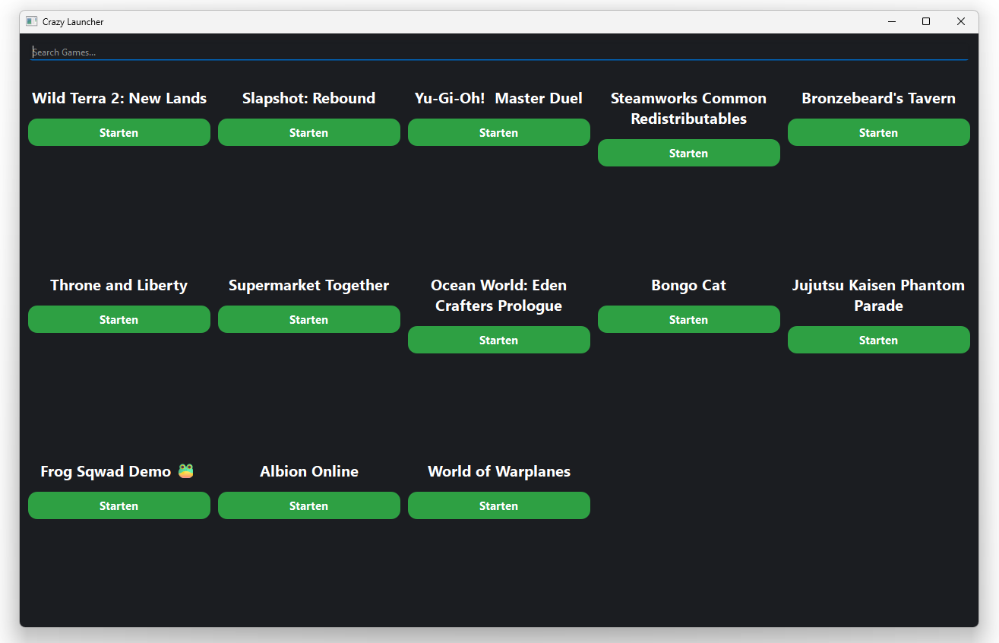

# 🚀 Crazy Launcher

  

<h3 align="center">
  Your games. One launcher.
</h3>

  A Windows game launcher that automatically detects and launches your installed games.

---

## ✨ Features

🎮 **Automatic Game Detection**
> Finds your installed Steam games automatically.

⚡ **Fast Launching**
> Start your games directly from one place.

🔍 **Game Library**
> View your games in an organized launcher.

---

## 📸 Preview

---

## 📥 Installation

1. Download the latest version from **Releases**
2. Run `CrazyLauncherSetup.exe`
3. Install and launch Crazy Launcher

---

## 🛠️ Built With

- Python
- PySide6
- Qt Style Sheets (QSS)
- Steam API / App Detection

---

## 📌 Roadmap

- [x] Steam detection
- [x] Game cards
- [x] Custom UI
- [ ] More launchers
- [ ] Themes
- [ ] User profiles

---

## 📄 License

MIT License
